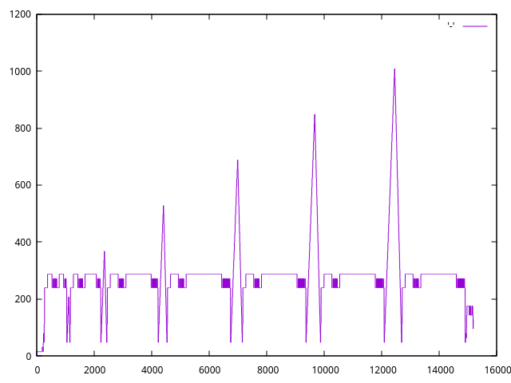

## Stack usage with GDB single-stepping

This example is based on the article by Noah Pendleton from Memfault, see blog post [Measuring Stack Usage the Hard Way](https://interrupt.memfault.com/blog/measuring-stack-usage).

### Run RV32 example using QEMU

Run example in RV32 QEMU using 'virt' machine:

```bash
$ make
0! = 1
5! = 120
10! = 3628800
15! = 2004310016
20! = 2192834560
25! = 2076180480
30! = 1409286144
```

### Single-step RV32 example in QEMU

In one console start QEMU and wait for GDB:

```bash
$ make gdb
```

In the other console connect GDB and check custom commands:

```bash
$ riscv32-picolibc-elf-gdb
0x00001000 in ?? ()
(gdb) hello-world 
Hello, World!
(gdb) stack_tracer
...
0x2000199a in ?? ()
0x2000199e in ?? ()
0x200019a0 in ?? ()
0x200019a2 in ?? ()
0x20001a80 in ?? ()
0x20001a84 in ?? ()
[Inferior 1 (process 1) exited normally]
(gdb) exit
```

Finally, present collected stack usage in graphical form:

```bash
$ cat stack.log | gnuplot -e "plot '-' with lines" -persist
```

Current simple factorial example has the following stack usage:


